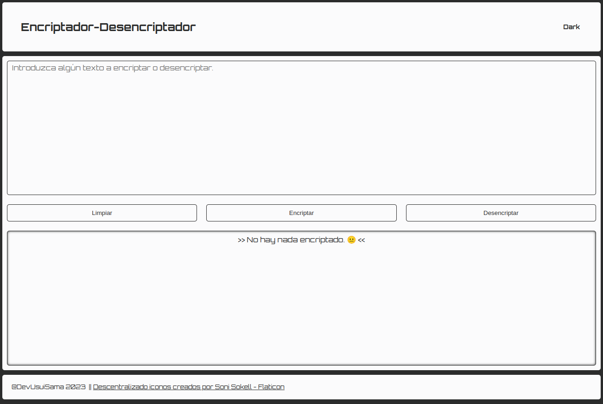

# Encriptador

## Descripción

Este proyecto fue desarrollado durante el curso de Alura, la cual trata de una sencilla pagina que encripta y desencripta los textos introducidos por el usuario.

## Previsualización

## Copiar Texto

Para copiar el texto resultantes del proceso de encriptado, solamente hay que darle un click al elemento que desee copiar.

## Insignia [Alura Challenges]

## Construido con 🛠️

* HTML5
* CSS3
* JavaScript

## Autor ✒️
* **Usui, José Fernando** - *Diseño y Desarrollo de la Pagina*

## Contacto 📱
* Gmail: _joesesilvae@gmail.com_